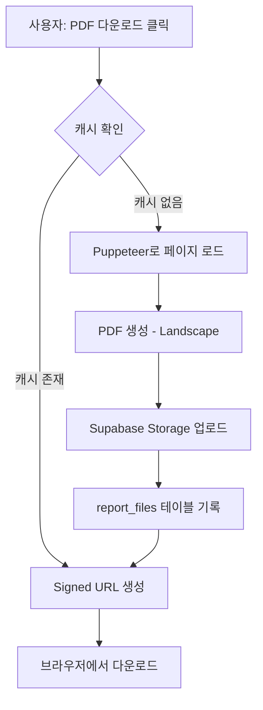

# Phase 7: PDF 다운로드 기능 구현

## 📋 개요

웹 리포트와 동일한 레이아웃으로 PDF를 생성하고 다운로드하는 기능을 구현합니다.

**주요 기능**:
- Landscape 8장 PDF 생성
- PDF 캐싱 (7일)
- Supabase Storage를 통한 파일 관리
- 빠른 재다운로드

---

## 🗂️ 데이터베이스 구조

### `report_files` 테이블

| 컬럼 | 타입 | 설명 |
|------|------|------|
| `file_id` | BIGSERIAL | Primary Key |
| `cmny_id` | INTEGER | 고객사 ID |
| `year_month` | CHAR(6) | 년월 (YYYYMM) |
| `file_type` | TEXT | 파일 타입 (pdf, excel) |
| `file_name` | TEXT | 파일명 |
| `storage_path` | TEXT | Storage 경로 |
| `file_size` | BIGINT | 파일 크기 (bytes) |
| `generated_at` | TIMESTAMPTZ | 생성 일시 |
| `expires_at` | TIMESTAMPTZ | 만료 일시 (7일 후) |

**UNIQUE 제약**: `(cmny_id, year_month, file_type)`

---

## 📦 Supabase Storage

### `reports` 버킷

**설정**:
- Public: `FALSE` (비공개)
- File Size Limit: 10MB
- Allowed MIME Types: `application/pdf`

**경로 구조**:
```
reports/
  └── {cmny_id}/
      └── {year_month}/
          └── {company_name}_{year_month}_report.pdf
```

**예시**:
```
reports/153/202511/SK렌터카_202511_report.pdf
```

---

## 🔧 기술 스택

| 항목 | 기술 |
|------|------|
| PDF 생성 | Puppeteer 21.0.0 |
| API | Next.js API Routes |
| Storage | Supabase Storage |
| 캐싱 | Database + Storage |

---

## 🚀 구현 파일

### 1. 마이그레이션

**`024_report_files_table.sql`**
- `report_files` 테이블 생성
- RLS 정책 설정
- 만료 파일 정리 함수

### 2. Storage 설정

**`supabase/storage/buckets.sql`**
- `reports` 버킷 생성
- Storage RLS 정책

### 3. API 엔드포인트

**`app/api/reports/generate-pdf/route.ts`**

**POST /api/reports/generate-pdf**

**Request Body**:
```json
{
  "cmnyId": 153,
  "yearMonth": "202511"
}
```

**Response (Success)**:
```json
{
  "success": true,
  "url": "https://...",
  "cached": false,
  "fileId": 1,
  "fileName": "SK렌터카_202511_report.pdf"
}
```

**Response (Cached)**:
```json
{
  "success": true,
  "url": "https://...",
  "cached": true,
  "fileId": 1
}
```

### 4. 프론트엔드

**`ReportActionsClient.tsx`**
- PDF 다운로드 버튼
- 로딩 상태 관리
- 에러 핸들링

---

## 📝 PDF 생성 플로우



---

## ⚙️ 설정 방법

### 1. 환경 변수 설정

`.env.local` 파일에 추가:
```bash
NEXT_PUBLIC_APP_URL=http://localhost:3000
```

프로덕션:
```bash
NEXT_PUBLIC_APP_URL=https://yourdomain.com
```

### 2. 패키지 설치

```bash
npm install puppeteer date-fns
```

### 3. 마이그레이션 실행

```sql
-- Supabase SQL Editor에서 실행
1. supabase/migrations/024_report_files_table.sql
2. supabase/storage/buckets.sql
```

### 4. Storage 버킷 확인

Supabase Dashboard → Storage → `reports` 버킷 생성 확인

---

## 🎨 PDF 레이아웃 설정

### Puppeteer 옵션

```typescript
await page.pdf({
  format: 'A4',
  landscape: true,  // 가로 방향
  printBackground: true,  // 배경색 포함
  margin: {
    top: '10mm',
    right: '10mm',
    bottom: '10mm',
    left: '10mm',
  },
});
```

### 예상 페이지 구성 (8장)

1. **표지** (1장)
2. **요약 리포트** (1장)
3. **차량별 가동률** (1장)
4. **총 월 주행거리** (1장)
5. **업무용승용차 운행기록부** (1장)
6. **구성원별 평균안전점수** (1장)
7. **정비현황 + 사고내역** (1장)
8. **범칙금 + 서비스 소개** (1장)

---

## 🔒 보안

### RLS 정책

**report_files 테이블**:
- SELECT: 승인된 사용자
- INSERT/UPDATE/DELETE: Admin만

**Storage (reports 버킷)**:
- SELECT: 승인된 사용자
- INSERT/DELETE: Admin만

### Signed URL

- 유효기간: 1시간
- 매 다운로드마다 새로 생성

---

## 🧪 테스트 시나리오

### 1. 첫 PDF 생성
```bash
1. 리포트 화면에서 "PDF 다운로드" 클릭
2. "PDF 생성 중..." 메시지 표시
3. 약 5-10초 후 PDF 다운로드 시작
4. "PDF가 생성되었습니다." 알림
```

### 2. 캐시된 PDF 다운로드
```bash
1. 동일 리포트에서 다시 "PDF 다운로드" 클릭
2. 즉시 다운로드 시작 (1-2초)
3. "캐시된 PDF를 다운로드합니다." 알림
```

### 3. 만료된 캐시
```bash
1. 7일 후 다시 다운로드
2. 새로 PDF 생성
3. 이전 캐시는 자동 삭제
```

---

## 🐛 트러블슈팅

### 문제 1: Puppeteer 실행 오류

**증상**: `Error: Failed to launch the browser process`

**해결**:
```bash
# Linux 서버
sudo apt-get install -y chromium-browser

# Docker
RUN apt-get update && apt-get install -y \
    chromium \
    chromium-sandbox
```

### 문제 2: PDF 레이아웃 깨짐

**증상**: 웹과 PDF 레이아웃이 다름

**해결**:
1. `waitUntil: 'networkidle0'` 확인
2. CSS `@media print` 스타일 추가
3. `printBackground: true` 설정

### 문제 3: Storage 업로드 실패

**증상**: `Upload failed`

**해결**:
1. Storage 버킷이 생성되었는지 확인
2. RLS 정책 확인
3. 파일 크기 제한 (10MB) 확인

---

## 📊 성능 최적화

### 1. 캐싱 전략
- 7일 캐시 유효기간
- `expires_at` 기준 자동 정리

### 2. PDF 생성 최적화
- Headless 모드 사용
- `networkidle0` 대기
- 필요한 리소스만 로드

### 3. Storage 최적화
- Signed URL (1시간 유효)
- upsert로 중복 방지

---

## 🚀 배포 시 체크리스트

- [ ] `NEXT_PUBLIC_APP_URL` 환경 변수 설정
- [ ] Puppeteer 의존성 설치 확인
- [ ] Storage 버킷 생성 확인
- [ ] RLS 정책 활성화 확인
- [ ] 테스트 PDF 생성 확인
- [ ] 캐싱 동작 확인
- [ ] 만료 파일 정리 크론잡 설정 (옵션)

---

## 📞 추가 개선 사항 (Phase 8+)

- [ ] Excel 다운로드 기능
- [ ] PDF 커스터마이징 (표지 디자인)
- [ ] 이메일 전송 기능
- [ ] 스케줄 자동 생성
- [ ] 다중 월 비교 PDF

---

## 📖 참고 자료

- [Puppeteer Documentation](https://pptr.dev/)
- [Supabase Storage](https://supabase.com/docs/guides/storage)
- [Next.js API Routes](https://nextjs.org/docs/app/building-your-application/routing/route-handlers)

